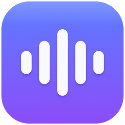
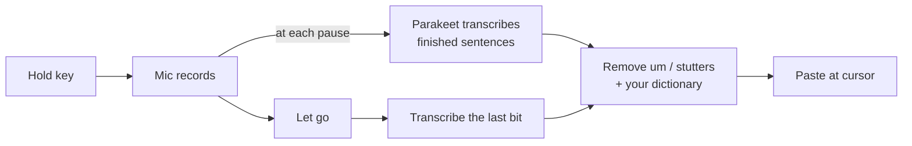

<div align="center">



# Whisp

**Hold a key, talk, let go — your words are typed wherever your cursor is.**<br>
Free, open-source voice dictation for Mac that runs 100% on your device.

[](#install)
[](#install)
[](https://swift.org)
[](LICENSE)

</div>

---

Whisp is a local alternative to Wispr Flow and Willow Voice. It uses NVIDIA's
Parakeet speech model running on your Mac's Neural Engine, so there's no
account, no subscription, and **no audio ever leaves your computer**.

## Why Whisp

- ⚡ **Fast.** Text appears ~0.15 s after you let go (median of 56 real
  dictations on a base 8 GB M1). Long dictations are transcribed *while you
  talk*, so a 2-minute ramble pastes as fast as a one-liner.
- 🔒 **Private.** Speech recognition happens on-device. After the one-time
  model download, Whisp works fully offline.
- 🧹 **Clean, never rewritten.** Removes "um", "uh", stutters ("the the") and
  restarts ("go to the go to desktop" → "go to desktop"). It only ever
  *subtracts* — it never paraphrases what you said.
- 📖 **Learns your words.** Menu → **Fix a Misheard Word…** teaches it names
  and jargon it gets wrong, instantly.
- 🎯 **Works everywhere.** Any app with a text cursor: Slack, Notes, VS Code,
  Terminal, your browser, AI chat boxes.
- 🪶 **Tiny.** A menu-bar app with no Dock icon. The mic is only on while you
  hold the key.

## Install

You'll need an **Apple Silicon Mac** on **macOS 14+** and the Xcode Command
Line Tools (`xcode-select --install`).

The quick way, which clones, builds and installs in one go:

```sh
curl -fsSL https://whisper.bishesha.com/install.sh | bash
```

Or build it yourself:

```sh
git clone https://github.com/bisheshabramhacharya/whisp.git
cd whisp
scripts/build-app.sh --install
```

That builds Whisp, copies it to `/Applications` and launches it. On first
launch it walks you through three permissions and downloads the speech model
(~1 GB, once).

> **Using Wispr Flow or Willow?** Quit it first — both apps listen for the
> same key.

## How to use it

| Do this | What happens |
|---|---|
| **Hold Right Option**, talk, let go | Your words are typed at the cursor |
| **Double-tap Right Option** | Hands-free: keeps listening until you press it again |
| **Esc** | Cancels — even right after you let go |
| **Cmd+Shift+V** | Re-paste your last dictation at the cursor |
| Menu bar → **Fix a Misheard Word…** | Teach Whisp a word it got wrong |
| Menu bar → **History** | Click any past dictation to copy it |

## Permissions

macOS asks for three things (System Settings → Privacy & Security):

| Permission | Why Whisp needs it |
|---|---|
| **Microphone** | To hear you |
| **Accessibility** | To type the text into the app you're using |
| **Input Monitoring** | To notice when you press Right Option |

## Teach it your words

Whisp keeps a personal dictionary at
`~/Library/Application Support/Whisp/dictionary.json`. The easy way to add to
it is **Fix a Misheard Word…** in the menu. You can also edit the file directly;
changes apply to your next dictation:

```json
{
  "terms": ["Kubernetes", "ChatGPT"],
  "replacements": [
    { "from": ["cloud code", "clawed code"], "to": "Claude Code" },
    { "from": ["kate's"], "to": "K8s" }
  ]
}
```

- `terms` fixes capitalization (*kubernetes* → *Kubernetes*).
- `replacements` swaps a misheard phrase for the right one. Matching is
  whole-word and case-insensitive.

## How it works



While you're still talking, Whisp cuts the audio at natural pauses and
transcribes those parts in the background. When you let go, only the last
few seconds are left to process. The text is pasted with a simulated ⌘V, and
your clipboard is put back afterwards.

## FAQ

**Is it really free?** Yes. MIT-licensed, no account, no telemetry.

**What languages?** English. Whisp uses Parakeet Unified 0.6B, an English
model.

**Intel Macs?** No. The model runs on the Apple Silicon Neural Engine.

**Where is my data?** In `~/Library/Application Support/Whisp/`: your history
(`history.jsonl`), dictionary, and recordings. Recordings are kept by default
so you can build a fine-tuning set; turn this off in the menu with **Keep
recordings**.

**Why build from source instead of a download?** Apps from the internet need
Apple notarization to open without warnings. Building locally avoids that, and
you can read every line of what you're running.

**Did paste-without-formatting stop working?** Whisp re-pastes your last
dictation with Cmd+Shift+V and swallows that chord system-wide, so apps that
use it for paste-without-formatting (Slack, Google Docs) never see it. Quit
Whisp when you need the original chord.

## Development

```sh
swift build                                   # debug build
swift run -c release whisp-tests              # tests
swift run -c release whisp-bench clip.wav     # speed + accuracy benchmark
```

<details>
<summary><b>Benchmarking</b></summary>

`whisp-bench` prints model load time, transcript, latency and memory per file.
A sibling `clip.txt` is scored as the reference transcript (WER).

- `--chunked` replays the transcribe-while-recording path and reports the
  release-time latency plus word differences vs whole-clip decoding. Run it over
  `~/Library/Application Support/Whisp/recordings/*.wav` after changing
  `SpeechSegmenter`.
- `--gap SECONDS` idles between runs, like real use. On M1, decodes run
  ~60–120 ms slower after even 0.1 s idle.
- `--streaming 320|640|1120` replays files through FluidAudio's streaming
  model. The 320 ms tier finished in ~33 ms but dropped more words than the
  offline model on real dictations, so Whisp stays offline.
- `--model`, `--itn`, `--vocab`: see `whisp-bench --help`.

The app logs per-stage timings. Watch them live with:

```sh
/usr/bin/log stream --predicate 'subsystem == "com.bishesha.whisp"'
```
</details>

<details>
<summary><b>Code signing (why permissions survive rebuilds)</b></summary>

macOS ties permission grants to the app's code signature. `build-app.sh` signs
with a self-signed identity named **"Whisp Local Signing"**, creating it if it
doesn't exist, so your grants survive rebuilds. If it falls back to ad-hoc
signing (locked keychain, CI shell), macOS re-asks for permissions after every
rebuild. To create the identity by hand:

```sh
cd "$(mktemp -d)"
openssl req -x509 -newkey rsa:2048 -nodes -days 3650 \
  -subj "/CN=Whisp Local Signing/O=Whisp Local Development/C=US" \
  -keyout key.pem -out cert.pem \
  -addext "basicConstraints=critical,CA:FALSE" \
  -addext "keyUsage=critical,digitalSignature" \
  -addext "extendedKeyUsage=critical,codeSigning"
openssl pkcs12 -export -password pass:whisp-tmp \
  -certpbe PBE-SHA1-3DES -keypbe PBE-SHA1-3DES -macalg sha1 \
  -inkey key.pem -in cert.pem -out id.p12
security import id.p12 -k ~/Library/Keychains/login.keychain-db \
  -P whisp-tmp -T /usr/bin/codesign -T /usr/bin/security
security add-trusted-cert -r trustRoot -p codeSign \
  -k ~/Library/Keychains/login.keychain-db cert.pem
security find-identity -p codesigning -v   # should list "Whisp Local Signing"
```

The legacy `PBE-SHA1-3DES`/`sha1` flags are required: macOS `security import`
can't read OpenSSL 3's default AES-encrypted PKCS12.

Build overrides: `SCRATCH`, `PRODUCT`, `APP_NAME`, `DIST`, `IDENTITY`
(`IDENTITY=-` forces ad-hoc signing).
</details>

<details>
<summary><b>Packaging internals</b></summary>

SwiftPM's generated accessor for FluidAudio resolves `Bundle.module` as
`Bundle.main.bundleURL + "/FluidAudio_FluidAudio.bundle"`. Inside an `.app`,
that is the app wrapper root, where `codesign` refuses to seal anything. So
`build-app.sh` copies bundles into `Contents/Resources/`, signs the app, then
adds root-level symlinks for `Bundle.module`. `codesign --verify --deep
--strict` therefore reports unsealed root contents afterwards; that's expected.
The executable signature, which permissions bind to, is valid.
</details>

<details>
<summary><b>Project layout</b></summary>

```
Sources/WhispCore    speech model, mic, hotkey, paste, storage, text cleanup
Sources/Whisp        menu-bar app (status bar, recording pill, onboarding)
Sources/whisp-bench  benchmark CLI
Sources/whisp-tests  test runner
Resources/           Info.plist, app icon
scripts/             build-app.sh, icon generation
```
</details>

## Credits

- [FluidAudio](https://github.com/FluidInference/FluidAudio) (Apache 2.0):
  runs Parakeet on Core ML and the Neural Engine
- [NVIDIA Parakeet](https://huggingface.co/nvidia): the speech recognition
  model

## License

[MIT](LICENSE)
