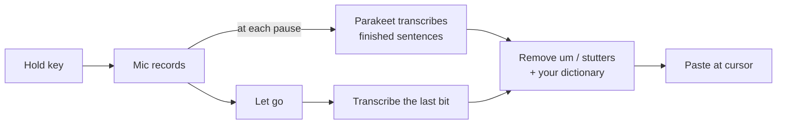

<div align="center">


# Whisp

**Hold a key. Talk. Let go. Your words appear wherever you're typing.**

Free, open-source voice dictation for Mac. It runs entirely on your Mac,
so your voice never leaves it.

[](#get-whisp)
[](#get-whisp)
[](https://swift.org)
[](LICENSE)

[Get Whisp](#get-whisp) · [How to use it](#how-to-use-it) · [FAQ](#faq)

</div>

---

Whisp is a free, local alternative to Wispr Flow and Willow Voice. No account,
no subscription, no cloud. It uses NVIDIA's Parakeet speech model on your
Mac's Neural Engine, and a short sentence is typed about 50 ms after you let
go.

## Why people use it

- ⚡ **Fast.** About 50 ms from letting go to text on a base M1, for short
  phrases. Long dictations are transcribed *while you talk*, so a 2-minute
  ramble pastes about as quickly as a one-liner.
- 🔒 **Private.** After a one-time model download, Whisp works with Wi-Fi off.
  No telemetry.
- 🧹 **Clean, never rewritten.** Drops "um", "uh", stutters ("the the") and
  false starts ("go to the go to desktop" → "go to desktop"). It only removes
  filler. It never rewords what you said.
- 📖 **Learns your words.** Correct a word after Whisp types it and it
  remembers the fix next time.
- 🎯 **Works everywhere.** Any app with a text cursor: Slack, Notes, Mail,
  VS Code, Terminal, your browser, ChatGPT or Claude.
- 🪶 **Stays out of the way.** Lives in the menu bar. The mic is only on while
  you hold the key.

## Get Whisp

**You need:** a Mac with Apple Silicon (M1 or newer) on macOS 14 Sonoma or
later.

### 1. Install

Open **Terminal** (press ⌘Space, type *Terminal*, press Return), paste this
line, and press Return:

```sh
curl -fsSL https://raw.githubusercontent.com/bisheshabramhacharya/whisp/main/install.sh | bash
```

This downloads the latest release, builds it on your Mac and puts
**Whisp.app** in your Applications folder. The first build takes a few
minutes.

If Terminal says `git` or the developer tools are missing, run
`xcode-select --install`, click **Install** in the window that opens, then
paste the line above again.

### 2. Allow three permissions

Whisp opens a **Set up Whisp** window that walks you through setup. On the
permissions step, click **Enable** next to each item and switch Whisp on in the
System Settings page that opens. The window ticks each one off as you go.
Setup then checks your microphone and has you dictate one practice message.
You can replay it any time from the menu bar with **Open Setup…**.

| Permission | Why Whisp needs it |
|---|---|
| **Microphone** | To hear you while you hold the key |
| **Accessibility** | To type the text into the app you're using |
| **Input Monitoring** | To notice the Right Option key in every app |

While you do this, Whisp downloads its speech model (about 1 GB, once). The
speech model step says **Ready to listen** when it's done.

### 3. Talk

Click into any text box, **hold the Right Option key** (the ⌥ key right of
the space bar), say something, and let go. A small pill at the bottom of the
screen shows the waveform while you talk, and your words are typed at the
cursor.

That's it. Whisp's icon sits in the menu bar at the top of the screen; there's
no Dock icon.

> **Using Wispr Flow or Willow?** Quit it first. Both listen for the same key.

**Updating:** paste the same install line again. It fetches the newest release
and keeps your settings, history and permissions.

## How to use it

| Do this | What happens |
|---|---|
| **Hold Right Option**, talk, let go | Your words are typed at the cursor |
| **Double-tap Right Option** | Hands-free: keeps listening until you press it again |
| **Esc** | Cancels, even right after you let go |
| **⌘⇧V** | Types your last dictation again |
| Menu bar → **Fix a Misheard Word…** | Teach Whisp a word it got wrong |
| Menu bar → **History** | Click any past dictation to copy it |

## Teach it your words

The easy way is **Fix a Misheard Word…** in the menu, or just correct the word
by hand after Whisp types it. Whisp learns only the word you changed, and the
menu has an Undo.

Power users can edit `~/Library/Application Support/Whisp/dictionary.json`
directly. Changes apply to your next dictation:

```json
{
  "terms": ["Kubernetes", "ChatGPT"],
  "replacements": [
    { "from": ["cloud code", "clawed code"], "to": "Claude Code" },
    { "from": ["kate's"], "to": "K8s" }
  ]
}
```

- `terms` fixes capitalization (*kubernetes* → *Kubernetes*).
- `replacements` swaps a misheard phrase for the right one. Matching is
  whole-word and ignores case.

## How it works


```mermaid
flowchart LR
    A[Hold key] --> B[Mic records]
    B -->|at each pause| C[Parakeet transcribes<br>finished sentences]
    B --> D[Let go]
    D --> E[Transcribe the last bit]
    C --> F[Remove um / stutters<br>+ your dictionary]
    E --> F
    F --> G[Paste at cursor]
```

While you talk, Whisp cuts the audio at natural pauses and transcribes those
parts in the background. When you let go, only the last few seconds are left.
It also runs the model on the shortest audio window that fits what you said,
instead of always paying for 15 seconds. The text is pasted with a simulated
⌘V, and your clipboard is put back afterwards.

## FAQ

**Is it really free?** Yes. MIT-licensed, no account, no telemetry.

**Why Parakeet and not Whisper?** For English, NVIDIA's Parakeet models score
better than Whisper Large on the
[Open ASR Leaderboard](https://huggingface.co/spaces/hf-audio/open_asr_leaderboard)
while running many times faster, and on a Mac it runs on the Neural Engine,
leaving your CPU and GPU free. Whisp then tunes how it runs the model for
short dictations; the measurements are in [docs/speed](docs/speed/README.md).

**What languages?** English only for now. Whisp uses Parakeet Unified 0.6B,
an English model.

**Intel Macs?** No. The model needs the Apple Silicon Neural Engine.

**Why isn't there a .dmg to download?** Apps downloaded from the internet
need Apple notarization (a paid developer account) to open without scary
warnings. Building on your Mac avoids that, and you can read every line of
what you run.

**What does Whisp download?** Only models, once: the speech model from
[Hugging Face](https://huggingface.co/FluidInference/parakeet-unified-en-0.6b-coreml),
and a faster 5-second encoder (about 525 MB) from this repo's
[`models-v1` release](https://github.com/bisheshabramhacharya/whisp/releases/tag/models-v1),
checked against a SHA-256 before use. Whisp works fine before the second one
arrives. Your audio and text never leave the Mac.

**Where is my data?** In `~/Library/Application Support/Whisp/`, readable only
by your user account: history (`history.jsonl`), dictionary, and recordings.
Recordings are kept by default (about 1 MB per 30 s of speech) so you can
build a fine-tuning set. Turn this off with **Keep recordings** in the menu.

**Did paste-without-formatting stop working?** Whisp uses ⌘⇧V to re-type your
last dictation, so apps that use that shortcut for paste-without-formatting
(Slack, Google Docs) don't see it while Whisp runs.

**How do I uninstall?** Quit Whisp from the menu bar, then delete
`/Applications/Whisp.app`. To remove everything, also delete `~/.whisp`,
`~/Library/Application Support/Whisp` and
`~/Library/Application Support/FluidAudio`.

**Something went wrong?** [Open an issue](https://github.com/bisheshabramhacharya/whisp/issues)
and include your Mac model and macOS version.

## Development

```sh
swift build                                   # debug build
swift run -c release whisp-tests              # tests (WHISP_TEST_PASTEBOARD=1 adds the real-clipboard ones)
swift run -c release whisp-bench clip.wav     # speed + accuracy benchmark
```

<details>
<summary><b>Benchmarking</b></summary>

`whisp-bench` prints model load time, transcript, latency and memory per file.
A sibling `clip.txt` is scored as the reference transcript (WER).

- `--compare short,parakeet` runs engines interleaved over the same files and
  reports latency, WER against sibling `.txt` files, and word agreement with
  the first engine. Use it before changing any engine.
- `--replay` runs the real transcribe-while-talking loop over each file and
  simulates letting go at several offsets after the last word: wait p50/p95
  and whether the last word survived. Use it after changing `SpeechSegmenter`.
- `--profile` splits one decode into mel / encoder / joint / decoder time.
- `--chunked`, `--gap`, `--streaming`, `--model`, `--itn`, `--vocab`: see
  `whisp-bench --help`.

Engines are picked with a hidden setting, e.g.
`defaults write com.bishesha.whisp asrEngine parakeet` (then relaunch).
`short` is the default; `parakeet`, `streaming` and `par2` are kept for A/B
tests. What was measured and why is in [docs/speed](docs/speed/README.md).

The app logs per-stage timings. Watch them live with:

```sh
/usr/bin/log stream --predicate 'subsystem == "com.bishesha.whisp"'
```
</details>

<details>
<summary><b>Code signing (why permissions survive rebuilds)</b></summary>

macOS ties permission grants to the app's code signature. `build-app.sh` signs
with a self-signed identity named **"Whisp Local Signing"**, creating it if it
doesn't exist, so your grants survive rebuilds. If it falls back to ad-hoc
signing (locked keychain, CI shell), macOS re-asks for permissions after every
rebuild. To create the identity by hand:

```sh
cd "$(mktemp -d)"
openssl req -x509 -newkey rsa:2048 -nodes -days 3650 \
  -subj "/CN=Whisp Local Signing/O=Whisp Local Development/C=US" \
  -keyout key.pem -out cert.pem \
  -addext "basicConstraints=critical,CA:FALSE" \
  -addext "keyUsage=critical,digitalSignature" \
  -addext "extendedKeyUsage=critical,codeSigning"
openssl pkcs12 -export -password pass:whisp-tmp \
  -certpbe PBE-SHA1-3DES -keypbe PBE-SHA1-3DES -macalg sha1 \
  -inkey key.pem -in cert.pem -out id.p12
security import id.p12 -k ~/Library/Keychains/login.keychain-db \
  -P whisp-tmp -T /usr/bin/codesign -T /usr/bin/security
security find-identity | grep "Whisp Local Signing"   # should list it
```

The certificate is deliberately *not* trusted for code signing (no
`add-trusted-cert`): `codesign` signs fine with an untrusted self-signed
identity, and codeSign trust would let anything signed with that local key
pass signature checks on your Mac. The first time `codesign` uses the key,
macOS may ask once for your login keychain password — choose **Always
Allow** and it never asks again.

The legacy `PBE-SHA1-3DES`/`sha1` flags are required: macOS `security import`
can't read OpenSSL 3's default AES-encrypted PKCS12.

Build overrides: `SCRATCH`, `PRODUCT`, `APP_NAME`, `DIST`, `IDENTITY`
(`IDENTITY=-` forces ad-hoc signing).
</details>

<details>
<summary><b>Packaging internals</b></summary>

SwiftPM's generated accessor for FluidAudio resolves `Bundle.module` as
`Bundle.main.bundleURL + "/FluidAudio_FluidAudio.bundle"`. Inside an `.app`,
that is the app wrapper root, where `codesign` refuses to seal anything. So
`build-app.sh` copies bundles into `Contents/Resources/`, signs the app, then
adds root-level symlinks for `Bundle.module`. `codesign --verify --deep
--strict` therefore reports unsealed root contents afterwards; that's expected.
The executable signature, which permissions bind to, is valid.
</details>

<details>
<summary><b>Project layout</b></summary>

```
Sources/WhispCore    speech model, mic, hotkey, paste, storage, text cleanup
Sources/Whisp        menu-bar app (status bar, recording pill, onboarding)
Sources/whisp-bench  benchmark CLI
Sources/whisp-tests  test runner
Resources/           Info.plist, app icon
scripts/             build-app.sh, icon generation; speed/ has test-set tools
tools/convert/       rebuilds the Core ML models (incl. the 5 s encoder) from NVIDIA's checkpoint
docs/speed/          speed measurements, including the dead ends
```
</details>

## Credits

- [FluidAudio](https://github.com/FluidInference/FluidAudio) (Apache 2.0):
  runs Parakeet on Core ML and the Neural Engine
- [NVIDIA Parakeet Unified English 0.6B](https://huggingface.co/nvidia/parakeet-unified-en-0.6b):
  the speech recognition model, used via the
  [Core ML build](https://huggingface.co/FluidInference/parakeet-unified-en-0.6b-coreml)
  packaged by FluidInference. Licensed by NVIDIA Corporation under the
  [NVIDIA Open Model License](https://www.nvidia.com/en-us/agreements/enterprise-software/nvidia-open-model-license/);
  the Core ML repo is also marked
  [CC-BY-4.0](https://creativecommons.org/licenses/by/4.0/). Whisp downloads
  those weights on first run. The 5-second encoder in the `models-v1` release
  is the same weights re-traced at a shorter input window and int8-quantized
  with [`tools/convert`](tools/convert/README.md); it is redistributed under
  the same NVIDIA Open Model License.

## License

[MIT](LICENSE)
