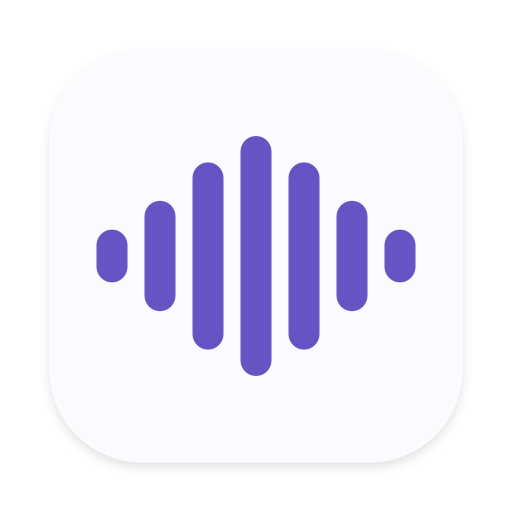
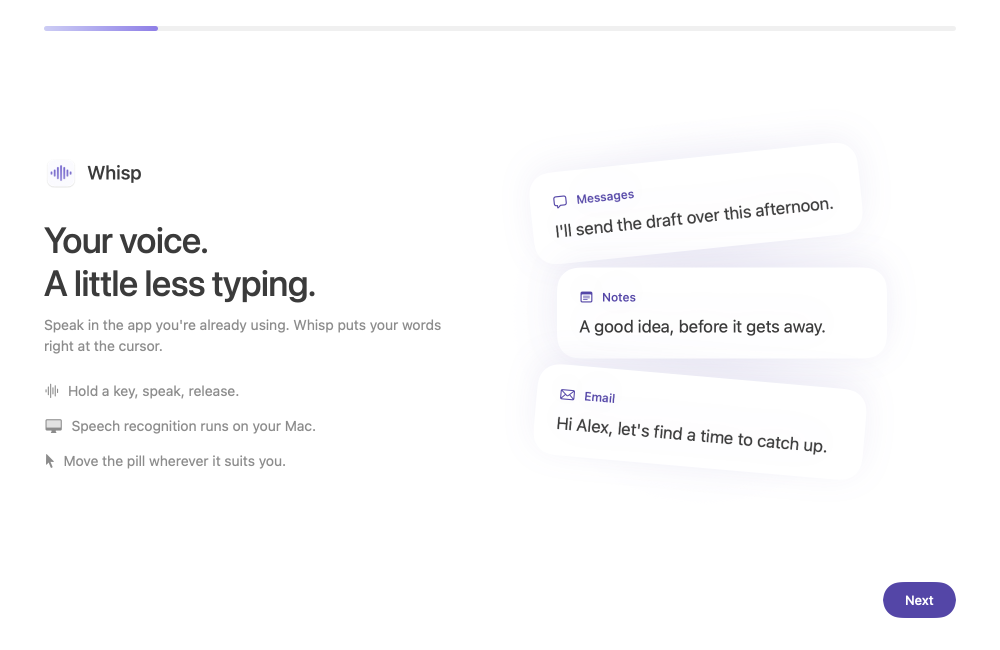
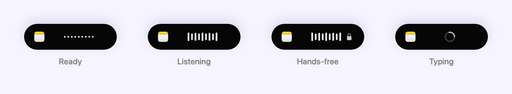
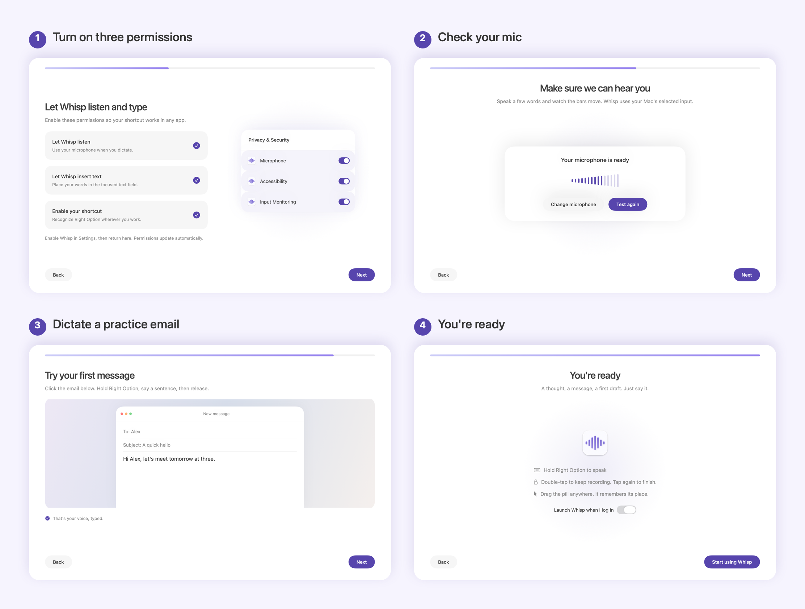
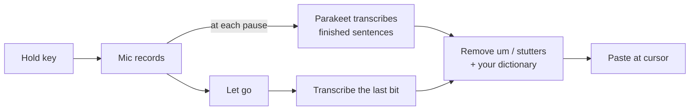

<div align="center">



# Whisp

### Your voice. A little less typing.

**Hold a key, say it, let go. Your words land wherever your cursor is.**

Free, open-source voice dictation for Mac. Runs entirely on your Mac.
No account, no subscription, no cloud.

[](#what-you-need)
[](#what-you-need)
[](#is-it-private)
[](LICENSE)

[Install](#install) · [How to use it](#how-to-use-it) · [How fast?](#how-fast-is-it) · [FAQ](#faq)

<br>



</div>

---

You talk a lot faster than you type. Whisp lets you use that.

Hold **Right Option**, say what you want to write, and let go. A moment later
it's typed into Slack, Mail, Notes, your code editor, ChatGPT, a browser tab,
anywhere there's a text cursor. It's like Wispr Flow or Willow Voice, except
it's free, it's open source, and your voice never leaves your Mac.

## Why you'll like it

- ⚡ **Fast.** A short sentence often appears in under a tenth of a second
  after you let go, even on a base M1. Long rambles are transcribed *while you
  talk*, so a two-minute brain dump pastes almost as fast as a one-liner.
- 🔒 **Private.** The speech model runs on your Mac's Neural Engine. After a
  one-time download it works with Wi-Fi off. No account, no telemetry.
- 🧹 **Cleans up, never rewrites.** Drops "um", "uh", stutters ("the the") and
  false starts ("go to the, go to desktop" → "go to desktop"). Everything else
  is exactly what you said.
- 📖 **Learns your words.** Fix a word after Whisp types it, and it gets it
  right next time. Names, jargon, that coworker whose name nobody spells right.
- 🙌 **Hands-free mode.** Double-tap the key and talk as long as you like. A
  little lock shows up in the pill so you know it's still listening.
- 🪶 **Stays out of your way.** One small pill you can drag anywhere. It shows
  which app you're typing into and remembers where you left it.

<p align="center">
  
</p>

## What you need

| | |
|---|---|
| **Mac** | Apple Silicon: any M1, M2, M3, M4 or newer. Intel Macs aren't supported. |
| **macOS** | 14 Sonoma or later |
| **Memory** | 8 GB is plenty. Whisp is tuned on a base 8 GB M1, the slowest Mac it supports. |
| **Disk** | About 2 GB for the speech models, plus Apple's free developer tools |
| **Internet** | Only once, to download the speech model |
| **Language** | English |

## Install

**1. Open Terminal.** Press ⌘Space, type *Terminal*, press Return.

**2. Paste this line and press Return:**

```sh
curl -fsSL https://raw.githubusercontent.com/bisheshabramhacharya/whisp/main/install.sh | bash
```

Grab a coffee. The installer downloads the latest release, builds it on your
Mac, and puts **Whisp.app** in your Applications folder. The first build takes
a few minutes.

> If Terminal says `git` or the developer tools are missing, run
> `xcode-select --install`, click **Install** in the window that pops up, then
> paste the line above again.

**3. Follow the setup window.** Whisp opens a short guided setup. It takes
a couple of minutes and ends with you dictating your first message:

<p align="center">
  
</p>

Along the way, Whisp asks for three permissions. Click **Enable**, switch
Whisp on in the System Settings page that opens, and come back. The window
ticks each one off by itself.

| Permission | Why Whisp needs it |
|---|---|
| **Microphone** | To hear you, only while you hold the key |
| **Accessibility** | To type your words into the app you're using |
| **Input Monitoring** | To notice the Right Option key in every app |

The speech model (about 1 GB) downloads in the background while you go
through setup. Want to see it again later? Pick **Open Setup…** from the
Whisp menu bar icon.

> **Using Wispr Flow or Willow?** Quit it first. They listen for the same key.

**Updating:** paste the same install line again. You keep your settings,
history, words and permissions.

## How to use it

| Do this | What happens |
|---|---|
| **Hold Right Option**, talk, let go | Your words are typed at the cursor |
| **Double-tap Right Option** | Hands-free: keeps listening until you press it again |
| **Esc** | Cancels, even right after you let go |
| **⌘⇧V** | Types your last dictation again |
| **Drag the pill** | Moves it. It stays where you put it. |
| Menu bar → **Fix a Misheard Word…** | Teach Whisp a word it got wrong |
| Menu bar → **History** | Click any past dictation to copy it |
| Menu bar → **Recording Pill** | Tiny, Small or Large, always shown or only while talking |

Whisp lives in the menu bar at the top of your screen. There's no Dock icon.

## How fast is it?

Fast on every Mac it supports. All the speed work was measured on the
**slowest** one, a base 8 GB M1, so newer Macs are at least as quick.

- Short phrases (under 5 seconds of speech) take about **49 ms** to
  transcribe on that M1, half of what the stock model needs.
- From letting go of the key to text on screen, half of real dictations
  finish within about **90 ms**.
- While you talk, Whisp transcribes each finished sentence at every pause. When
  you let go, only the last few seconds are left to do.

The model runs on the Neural Engine, Apple's chip for machine learning, so your
CPU and fans stay quiet. Every number, including the ideas that didn't work,
is in [docs/speed](docs/speed/README.md).

## Is it private?

Yes. Whisp transcribes everything on your Mac. Your audio and text are never
sent anywhere. The only things it downloads are the speech models, once.

Your history, dictionary and (if you keep them) recordings live in
`~/Library/Application Support/Whisp/`, readable only by your user account.
Setup asks whether to keep recordings, and you can change it any time with
**Keep recordings** in the menu.

## Teach it your words

The easy way is **Fix a Misheard Word…** in the menu, or just correct the word
by hand after Whisp types it. Whisp learns only the word you changed, and the
menu has an Undo.

Power users can edit `~/Library/Application Support/Whisp/dictionary.json`
directly. Changes apply to your next dictation:

```json
{
  "terms": ["Kubernetes", "ChatGPT"],
  "replacements": [
    { "from": ["cloud code", "clawed code"], "to": "Claude Code" },
    { "from": ["kate's"], "to": "K8s" }
  ]
}
```

- `terms` fixes capitalization (*kubernetes* → *Kubernetes*).
- `replacements` swaps a misheard phrase for the right one. Matching is
  whole-word and ignores case.

## How it works


```mermaid
flowchart LR
    A[Hold key] --> B[Mic records]
    B -->|at each pause| C[Parakeet transcribes<br>finished sentences]
    B --> D[Let go]
    D --> E[Transcribe the last bit]
    C --> F[Remove um / stutters<br>+ your dictionary]
    E --> F
    F --> G[Paste at cursor]
```

Whisp uses NVIDIA's Parakeet speech model. While you talk, it cuts the audio
at natural pauses and transcribes those parts in the background. It also runs
the model on the shortest audio window that fits what you said, instead of
always paying for 15 seconds. The text is pasted with a simulated ⌘V, and your
clipboard is put back afterwards.

## FAQ

**Is it really free?** Yes. MIT-licensed, no account, no telemetry, no catch.

**Why Parakeet and not Whisper?** For English, NVIDIA's Parakeet models score
better than Whisper Large on the
[Open ASR Leaderboard](https://huggingface.co/spaces/hf-audio/open_asr_leaderboard)
while running many times faster. On a Mac it runs on the Neural Engine,
leaving your CPU and GPU free.

**What languages?** English only for now. Whisp uses Parakeet Unified 0.6B,
an English model.

**Intel Macs?** No, sorry. The model needs the Apple Silicon Neural Engine.

**Why isn't there a .dmg to download?** Apps downloaded from the internet
need Apple notarization (a paid developer account) to open without scary
warnings. Building on your Mac avoids that, and you can read every line of
what you run.

**What exactly does Whisp download?** Only models, once: the speech model from
[Hugging Face](https://huggingface.co/FluidInference/parakeet-unified-en-0.6b-coreml),
and a faster 5-second encoder (about 525 MB) from this repo's
[`models-v1` release](https://github.com/bisheshabramhacharya/whisp/releases/tag/models-v1),
checked against a SHA-256 before use. Whisp works fine before the second one
arrives.

**How much space do recordings take?** About 1 MB per 30 seconds of speech.
Turn **Keep recordings** off in the menu and Whisp discards audio after
transcribing.

**Did paste-without-formatting stop working?** Whisp uses ⌘⇧V to re-type your
last dictation, so apps that use that shortcut for paste-without-formatting
(Slack, Google Docs) don't see it while Whisp runs.

**How do I uninstall?** Quit Whisp from the menu bar, then delete
`/Applications/Whisp.app`. To remove everything, also delete `~/.whisp`,
`~/Library/Application Support/Whisp` and
`~/Library/Application Support/FluidAudio`.

**Something went wrong?** [Open an issue](https://github.com/bisheshabramhacharya/whisp/issues)
and include your Mac model and macOS version.

**Like it?** Give the repo a ⭐. It helps other people find it.

## Development

```sh
swift build                                   # debug build
swift run -c release whisp-tests              # tests (WHISP_TEST_PASTEBOARD=1 adds the real-clipboard ones)
swift run -c release whisp-bench clip.wav     # speed + accuracy benchmark
bash scripts/build-app.sh && dist/Whisp.app/Contents/MacOS/Whisp --render-designs /tmp/whisp-previews
                                              # setup + pill screenshots and UI checks
```

The screenshots in this README come from `--render-designs`. Manual test steps
are in [docs/design-testing.md](docs/design-testing.md).

<details>
<summary><b>Benchmarking</b></summary>

`whisp-bench` prints model load time, transcript, latency and memory per file.
A sibling `clip.txt` is scored as the reference transcript (WER).

- `--compare short,parakeet` runs engines interleaved over the same files and
  reports latency, WER against sibling `.txt` files, and word agreement with
  the first engine. Use it before changing any engine.
- `--replay` runs the real transcribe-while-talking loop over each file and
  simulates letting go at several offsets after the last word: wait p50/p95
  and whether the last word survived. Use it after changing `SpeechSegmenter`.
- `--profile` splits one decode into mel / encoder / joint / decoder time.
- `--chunked`, `--gap`, `--streaming`, `--model`, `--itn`, `--vocab`: see
  `whisp-bench --help`.

Engines are picked with a hidden setting, e.g.
`defaults write com.bishesha.whisp asrEngine parakeet` (then relaunch).
`short` is the default; `parakeet`, `streaming` and `par2` are kept for A/B
tests. What was measured and why is in [docs/speed](docs/speed/README.md).

The app logs per-stage timings. Watch them live with:

```sh
/usr/bin/log stream --predicate 'subsystem == "com.bishesha.whisp"'
```
</details>

<details>
<summary><b>Code signing (why permissions survive rebuilds)</b></summary>

macOS ties permission grants to the app's code signature. `build-app.sh` signs
with a self-signed identity named **"Whisp Local Signing"**, creating it if it
doesn't exist, so your grants survive rebuilds. If it falls back to ad-hoc
signing (locked keychain, CI shell), macOS re-asks for permissions after every
rebuild. To create the identity by hand:

```sh
cd "$(mktemp -d)"
openssl req -x509 -newkey rsa:2048 -nodes -days 3650 \
  -subj "/CN=Whisp Local Signing/O=Whisp Local Development/C=US" \
  -keyout key.pem -out cert.pem \
  -addext "basicConstraints=critical,CA:FALSE" \
  -addext "keyUsage=critical,digitalSignature" \
  -addext "extendedKeyUsage=critical,codeSigning"
openssl pkcs12 -export -password pass:whisp-tmp \
  -certpbe PBE-SHA1-3DES -keypbe PBE-SHA1-3DES -macalg sha1 \
  -inkey key.pem -in cert.pem -out id.p12
security import id.p12 -k ~/Library/Keychains/login.keychain-db \
  -P whisp-tmp -T /usr/bin/codesign -T /usr/bin/security
security find-identity | grep "Whisp Local Signing"   # should list it
```

The certificate is deliberately *not* trusted for code signing (no
`add-trusted-cert`): `codesign` signs fine with an untrusted self-signed
identity, and codeSign trust would let anything signed with that local key
pass signature checks on your Mac. The first time `codesign` uses the key,
macOS may ask once for your login keychain password — choose **Always
Allow** and it never asks again.

The legacy `PBE-SHA1-3DES`/`sha1` flags are required: macOS `security import`
can't read OpenSSL 3's default AES-encrypted PKCS12.

Build overrides: `SCRATCH`, `PRODUCT`, `APP_NAME`, `DIST`, `IDENTITY`
(`IDENTITY=-` forces ad-hoc signing).
</details>

<details>
<summary><b>Packaging internals</b></summary>

SwiftPM's generated accessor for FluidAudio resolves `Bundle.module` as
`Bundle.main.bundleURL + "/FluidAudio_FluidAudio.bundle"`. Inside an `.app`,
that is the app wrapper root, where `codesign` refuses to seal anything. So
`build-app.sh` copies bundles into `Contents/Resources/`, signs the app, then
adds root-level symlinks for `Bundle.module`. `codesign --verify --deep
--strict` therefore reports unsealed root contents afterwards; that's expected.
The executable signature, which permissions bind to, is valid.
</details>

<details>
<summary><b>Project layout</b></summary>

```
Sources/WhispCore    speech model, mic, hotkey, paste, storage, text cleanup
Sources/Whisp        menu-bar app (status bar, recording pill, onboarding)
Sources/whisp-bench  benchmark CLI
Sources/whisp-tests  test runner
Resources/           Info.plist, app icon
scripts/             build-app.sh, icon generation; speed/ has test-set tools
tools/convert/       rebuilds the Core ML models (incl. the 5 s encoder) from NVIDIA's checkpoint
docs/speed/          speed measurements, including the dead ends
```
</details>

## Credits

- [FluidAudio](https://github.com/FluidInference/FluidAudio) (Apache 2.0):
  runs Parakeet on Core ML and the Neural Engine
- [NVIDIA Parakeet Unified English 0.6B](https://huggingface.co/nvidia/parakeet-unified-en-0.6b):
  the speech recognition model, used via the
  [Core ML build](https://huggingface.co/FluidInference/parakeet-unified-en-0.6b-coreml)
  packaged by FluidInference. Licensed by NVIDIA Corporation under the
  [NVIDIA Open Model License](https://www.nvidia.com/en-us/agreements/enterprise-software/nvidia-open-model-license/);
  the Core ML repo is also marked
  [CC-BY-4.0](https://creativecommons.org/licenses/by/4.0/). Whisp downloads
  those weights on first run. The 5-second encoder in the `models-v1` release
  is the same weights re-traced at a shorter input window and int8-quantized
  with [`tools/convert`](tools/convert/README.md); it is redistributed under
  the same NVIDIA Open Model License.

## License

[MIT](LICENSE)
